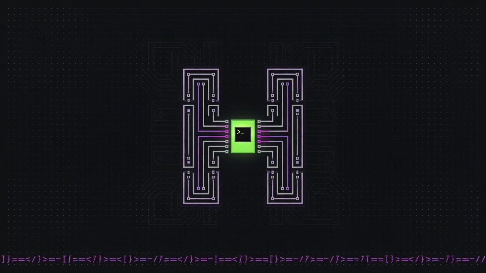
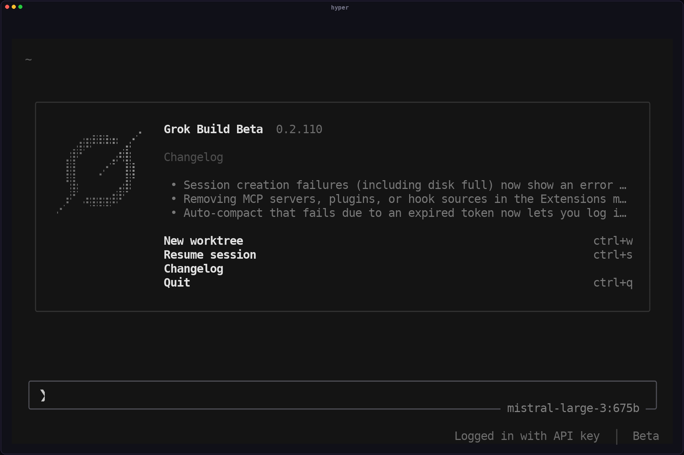

<div align="center">

<h1>Hyper(<code>hyper</code>)</h1>



<p>
  <a href="https://github.com/DaviRain-Su/hyper-grok-build/releases"></a>
  <a href="https://github.com/DaviRain-Su/hyper-grok-build/actions/workflows/release.yml"></a>
  <a href="LICENSE"></a>
  
  
  <a href="https://github.com/DaviRain-Su/hyper-grok-build/releases"></a>
  
</p>

**Hyper** 是 [Grok Build](https://github.com/xai-org/grok-build) 的非官方多供应商社区构建版本 ——
一个用 Rust 编写的终端 AI 编码代理,对多家 LLM 供应商提供一流支持:
xAI Grok、Kimi Code / Moonshot、ChatGPT Codex、OpenCode Go、OpenAI、Anthropic、Z.AI、Ollama Cloud 等。

它以全屏 TUI 的形式运行,能够理解你的代码库、编辑文件、
执行 shell 命令、搜索网页,并管理长时间运行的任务 ——
既可以在终端中交互使用,也可以无头模式用于脚本/CI,
还能通过 Agent Client Protocol(ACP)嵌入到编辑器中。
UI 已本地化为 10 种语言(English、中文、日本語、한국어、Español、
Português、Français、Deutsch、Русский),并可在设置中实时切换。运行
`hyper web` 启动面向 Tailscale 的浏览器控制面（先提供带 token 的监听器；会话聊天尚未接通），说明见 [docs/web-over-tailscale.md](docs/web-over-tailscale.md)。
`hyper dashboard --web` 可以打开本地只读的纯 Rust Web 仪表盘，查看会话指标、
事件时间线、图表、日志和实时事件流。

[安装](#安装) ·
[供应商](#供应商) ·
[从源码构建](#从源码构建) ·
[发布](#发布) ·
[与官方 <code>grok</code> 共存](#与官方-grok-共存) ·
[许可证](#许可证)

**English: [README.md](README.md)** ·
**中文用户指南: [docs/user-guide-zh-CN/](packages/tui/xai-grok-pager/docs/user-guide-zh-CN/)**

</div>

---

## 界面截图

真实 TUI(在 PTY 中用仓库内置的
[`tui_shot`](packages/tui/xai-grok-pager-pty-harness/examples/tui_shot.rs)
工具捕获),展示 10 种 UI 语言中的两种:

| English | 简体中文 |
| ------- | -------- |
|  |  |

---

## 为什么叫 "Hyper"?

本 fork 仓库已经命名为 `hyper-grok-build`,**Hyper** 沿用了这个品牌:

| | 官方版本 | 本 fork |
|---|---|---|
| 产品 | Grok Build | **Hyper** |
| 二进制文件 | `grok` | **`hyper`** |
| 安装目录 | `~/.grok` | **`~/.hyper`**(仅二进制) |
| 配置 / 认证 | `~/.grok` | **`~/.grok`**(共享;同一运行时) |
| 上游 | [xai-org/grok-build](https://github.com/xai-org/grok-build) | 多供应商社区补丁 |

简短的 CLI 名称,不与 `grok` 冲突,也为超越单一供应商留出了发展空间
(不像 [Kigi](https://github.com/ZacharyZhang-NY/Kigi-CLI) 这样只支持 Kimi 的 fork)。

---

## 安装

适用于 macOS(arm64/x86_64)、Linux(arm64/x86_64,
glibc / `linux-gnu` —— 按 **glibc 2.17+** 链接，可在 Ubuntu 16.04 / RHEL 7
及更新系统上运行，不要求 Ubuntu 24.04)以及 Windows
(x86_64)的预编译单文件二进制已发布在
[GitHub Releases](https://github.com/DaviRain-Su/hyper-grok-build/releases)。

管道执行 **Release 产物**（随 tag 固定，并写入 `SHA256SUMS`）。**不要**管道执行
git 分支 —— 那是 [issue #46](https://github.com/DaviRain-Su/hyper-grok-build/issues/46)
的注入路径。

```sh
# macOS / Linux
curl -fsSL https://github.com/DaviRain-Su/hyper-grok-build/releases/latest/download/install.sh | sh
```

```powershell
# Windows PowerShell
irm https://github.com/DaviRain-Su/hyper-grok-build/releases/latest/download/install.ps1 | iex
```

```sh
hyper --version
hyper login          # xAI / Grok 会话(浏览器 OAuth)
hyper                # 启动 TUI
```

安装指定版本（脚本仍会校验 `SHA256SUMS`）：

```sh
curl -fsSL https://github.com/DaviRain-Su/hyper-grok-build/releases/latest/download/install.sh | sh -s -- --version v1.0.12-r2
```

安装到 `~/.hyper/bin/hyper`（Windows 为
`%USERPROFILE%\.hyper\bin\hyper.exe`）。已经装过？`hyper update` 只读本仓库
GitHub Releases，不会覆盖官方 `~/.grok/bin/grok`。

> 如需尚未发布的改动，从下方源码构建。

### 用 Nix 安装

本项目提供 [Nix](https://nixos.org) flake(`flake.nix`)，在任意已启用
Nix 的机器上可跳过安装脚本，直接构建/运行。flake 构建出的 `hyper`
二进制与发布产物一致(Opus 与 jemalloc 均静态链接；`ldd` 仅依赖
glibc)。

```sh
# 直接从仓库运行(无需 clone、无需安装):
nix run github:DaviRain-Su/hyper-grok-build#hyper-grok-build -- --version

# 或安装到你的 Nix profile(把 `hyper` 加入 PATH):
nix profile install github:DaviRain-Su/hyper-grok-build#hyper-grok-build
```

从 clone 出来的仓库(例如要用未发布的改动或参与开发):

```sh
git clone https://github.com/DaviRain-Su/hyper-grok-build
cd hyper-grok-build
nix run .#hyper-grok-build -- --version      # 运行
nix build .#hyper-grok-build                 # 构建到 ./result
nix develop                                   # 提供 rust + protoc + cmake + git 的 shell
```

> 首次运行会从源码编译(现代机器约 14 分钟)。目前没有二进制缓存，因此
> 每个 Nix 用户暂时都要本地编译。支持 Linux(`x86_64`/`aarch64`)；
> macOS/Windows 未在 flake 中接入(对应平台请用上方的预编译二进制)。

---

## 供应商

Hyper 保留了本代码树中的多供应商注册表(见 pager
[用户指南（中文）](packages/tui/xai-grok-pager/docs/user-guide-zh-CN/)):

| 平台 | 认证方式 | 备注 |
| -------- | ---- | ----- |
| xAI / Grok | `hyper login`(OIDC)或 `XAI_API_KEY` | 第一方模型 |
| Kimi Code | 设备 OAuth / 订阅 | `kimi-code/*` 目录 |
| Moonshot CN / AI | API key | 开放平台 |
| ChatGPT Codex | ChatGPT OAuth | GPT-5.x reasoning，并支持实验性全双工 `/live` 语音 |
| OpenCode Go | 订阅 API key | `opencode-go/*` 模型，兼容 Chat Completions + Messages |
| OpenAI / Anthropic / DeepSeek 风格 | API keys | BYOK 目录 |
| Z.AI Coding Plan | 平台 key | 国际版方案 |
| Ollama Cloud | API key | 实时模型清单同步 |

选择器中的模型 id 形如 `{platform}/{model}`(例如
`kimi-code/k3`、`opencode-go/kimi-k3`、`openai-codex/gpt-5.6-sol`)。各平台文档位于
`packages/tui/xai-grok-pager/docs/user-guide-zh-CN/`(Moonshot、Kimi Code、
OpenAI Codex 等)。

配置和凭据仍然存放在 **`~/.grok`**(与上游 Grok Build 相同的路径),
因此已有的会话、API key 和 `auth.json` 可以继续使用。

---

## 从源码构建

环境要求:

- **Rust** —— 由 [`rust-toolchain.toml`](rust-toolchain.toml) 锁定版本
  (首次构建时 `rustup` 会自动安装)
- **[DotSlash](https://dotslash-cli.com)** —— 密封的 `bin/protoc`
  ```sh
  cargo install dotslash
  # 或者:brew install dotslash
  ```
- **CMake 3.5+** —— 构建实验性 `/live` 语音使用的内置静态 Opus；工作区已固定
  `CMAKE_POLICY_VERSION_MINIMUM=3.5`

```sh
cargo run -p xai-grok-pager-bin              # 构建并启动 TUI(二进制名:hyper)
cargo build -p xai-grok-pager-bin --profile release-dist
./target/release-dist/hyper --version
```

组合根包仍然是 `xai-grok-pager-bin`(monorepo 布局);
**发布的二进制名称**是 `hyper`。

---

## 更新日志

发布说明见 [`CHANGELOG.md`](./CHANGELOG.md)。已知限制见:
[`docs/KNOWN_ISSUES.md`](./docs/KNOWN_ISSUES.md)。

---

## 发布

1. 将根目录的 [`VERSION`](VERSION) 文件设置为 **monorepo 锁步客户端版本**
   (与 `packages/tui/xai-grok-pager/Cargo.toml` /
   `xai-grok-version` 保持一致,当前为 `0.2.119-r1`)。CI 会把它编译进
   `x-grok-client-version`;xAI 会拒绝低于 **0.1.202** 的客户端(HTTP 426)。
   **不要**自己编造一个较低的营销版本号(例如 `0.1.0`)。
2. 在 `dev`(或你的发布分支)上提交;更新 `CHANGELOG.md`。
3. 打标签并推送 —— CI 会构建五个目标平台并发布 GitHub Release:

```sh
VERSION=$(tr -d '[:space:]' < VERSION)
git tag "v${VERSION}"
git push origin "v${VERSION}"
```

工作流:[`.github/workflows/release.yml`](.github/workflows/release.yml)

构建产物:

| 产物 | 示例 |
| ----- | ------- |
| macOS arm64 | `hyper-0.2.119-r1-aarch64-apple-darwin.tar.gz` |
| macOS x86_64 | `hyper-0.2.119-r1-x86_64-apple-darwin.tar.gz` |
| Linux x86_64(glibc ≥2.17) | `hyper-0.2.119-r1-x86_64-unknown-linux-gnu.tar.gz` |
| Linux arm64(glibc ≥2.17) | `hyper-0.2.119-r1-aarch64-unknown-linux-gnu.tar.gz` |
| Windows x86_64 | `hyper-0.2.119-r1-x86_64-pc-windows-msvc.zip` |
| 校验和 | `SHA256SUMS` |

标签必须与 `VERSION` 完全一致(`v0.2.119-r1` ↔ `0.2.119-r1`),否则构建会失败。

---

## 与官方 `grok` 共存

Hyper 与 xAI / SpaceXAI **没有隶属关系**。在同一台机器上:

| 项目 | 官方 `grok` | Hyper |
|---------|-----------------|-------|
| 二进制 | `grok` | `hyper` |
| 托管安装目录 | `~/.grok/bin` | `~/.hyper/bin` |
| 配置 / 认证 / 会话 | `~/.grok` | **相同的** `~/.grok` |
| Leader IPC(`leader*.sock` / `.lock`) | 位于 `~/.grok` | **相同的**命名空间 |

注意事项:

- 会话、API key 和 OAuth 权限是共享的 —— 登录一次,两个 CLI 都能看到。
- Leader 的 list/kill 可以同时看到两个产品的 leader。请只 kill 你自己启动的 leader。
- 社区构建版使用完全隔离的更新器：`hyper update` 和启动时自动更新只读取本仓库的 GitHub Releases，Hyper 二进制及更新状态都保存在 `~/.hyper`（托管可执行文件为 `~/.hyper/bin/hyper`）。发布包中的 `bundled/**` 会事务性地安装到 `~/.grok/bundled`（或 `$GROK_HOME/bundled`），绝不会覆盖 `~/.grok/bin/grok`。自动更新偏好仍属于 Hyper 与官方版共享的 `~/.grok` 配置。修复安装请用 Release 产物安装脚本或 `hyper update`。

---

## 构建说明(本 fork)

```sh
# 默认启用 community-build（Hyper 品牌 + 隔离的社区更新器）。
cargo run -p xai-grok-pager-bin

# 显式构建发布风格的本地二进制
cargo build -p xai-grok-pager-bin --profile release-dist --features community-build
```

Amp 风格的 **agent 模式**(low / medium / high / ultra 档位)目前**仅有设计文档** ——
见 [`docs/design-modes.md`](docs/design-modes.md),尚未发布。

已知问题和剩余工作:[`docs/KNOWN_ISSUES.md`](docs/KNOWN_ISSUES.md)。

---

## 文档

仓库内用户指南(示例中可能仍写着 `grok`;Hyper 的二进制名是
`hyper`,路径仍在 `~/.grok` 下):

- 中文：[用户指南（中文）](packages/tui/xai-grok-pager/docs/user-guide-zh-CN/)
- English：[User Guide](packages/tui/xai-grok-pager/docs/user-guide/)

相关扩展文档：

- [Hooks 与 Plugins 指南（中文）](packages/tui/xai-grok-pager/docs/hooks-and-plugins.zh-CN.md)
- [自定义 Hooks 指南（中文）](packages/tui/xai-grok-pager/docs/custom-hooks.zh-CN.md)

上游产品文档:[docs.x.ai/build](https://docs.x.ai/build/overview)

`SOURCE_REV` 记录了本代码树最近一次同步的 monorepo 提交。

---

## 仓库结构

按 [pi-mono](https://github.com/earendil-works/pi) 风格将 crate 分到
`packages/*` 分层（crate 名仍为 `xai-*`，便于上游 merge）。
详见 [docs/ARCHITECTURE.md](docs/ARCHITECTURE.md) 与
[docs/UPSTREAM_PATH_MAP.md](docs/UPSTREAM_PATH_MAP.md)。

| 路径 | 内容 |
|------|----------|
| `packages/ai/` | 模型、鉴权、采样、HTTP、语音 |
| `packages/agent/` | Agent 循环、会话状态、压缩、HyperCore |
| `packages/tools/` | 工具、沙箱、workspace、computer-hub |
| `packages/tui/` | Pager TUI、渲染、Markdown、PTY |
| `packages/coding-agent/` | Shell 会话 + `hyper` 二进制组合根 |
| `packages/extensions/` | WASM 扩展宿主 / SDK / marketplace |
| `packages/platform/` | 路径、FS/git、崩溃、遥测、测试 |
| `packages/build/` | 构建辅助（protoc） |
| `desktop/comet/` | 可选**本地**桌面控制器（gpui；嵌套 workspace；已去云）。启动：`./scripts/run-desktop.sh` |
| `install.sh` / `install.ps1` | Release 产物安装脚本（不要管道执行 git 默认分支） |
| `.github/workflows/release.yml` | 多平台发布 CI |

> [!IMPORTANT]
> 优先编辑各 crate 自己的 `Cargo.toml`。新增 crate 时同步更新根目录
> `Cargo.toml` 的 workspace members。

---

## 许可证

Apache-2.0。见 [`LICENSE`](LICENSE)、[`NOTICE`](NOTICE) 和
[`THIRD-PARTY-NOTICES`](THIRD-PARTY-NOTICES)。

基于 Grok Build 开源项目
([xai-org/grok-build](https://github.com/xai-org/grok-build))。
